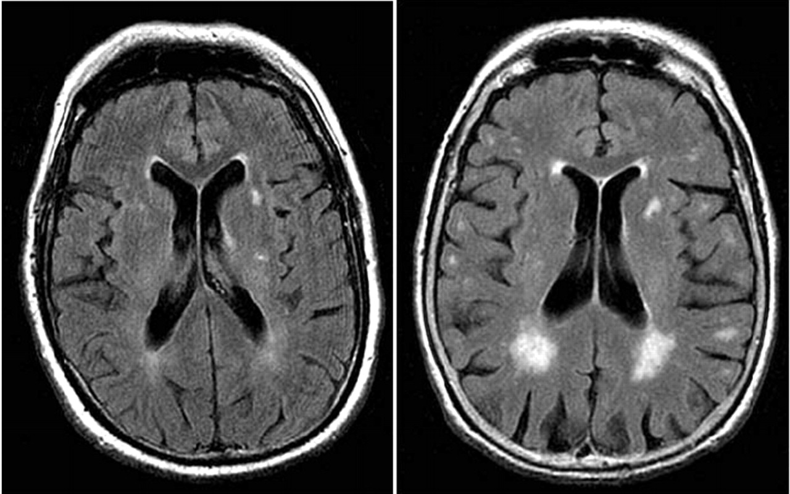
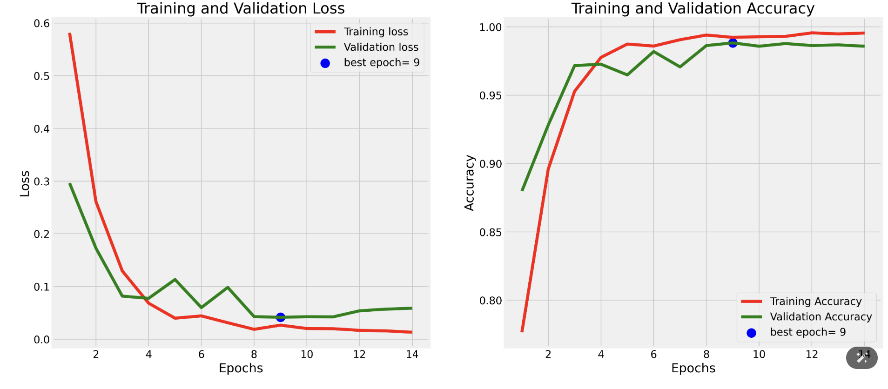
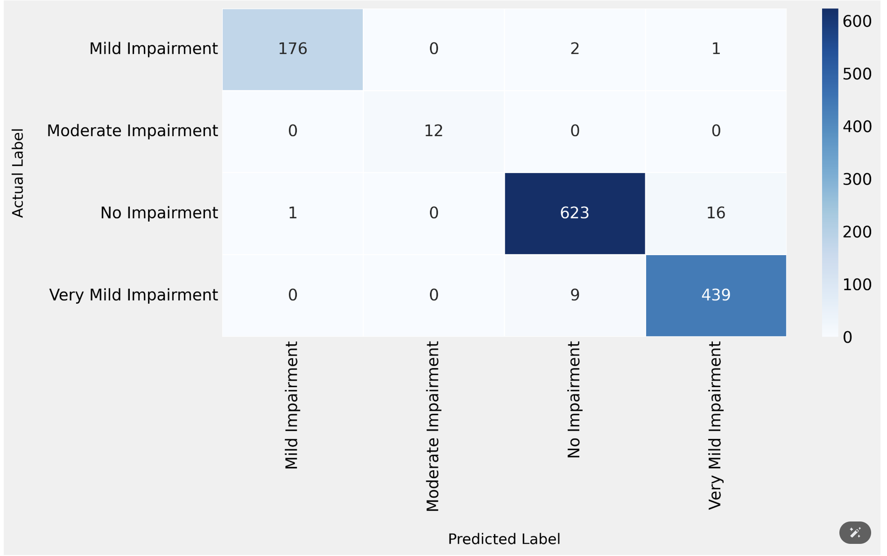

# 🧠 Alzheimers_MRI_Classification_Using_CNN



## 📌 Overview
This repository contains a deep learning-based classification model for detecting different stages of Alzheimer's disease using MRI (Magnetic Resonance Imaging) scans. The dataset includes MRI images categorized into four classes:

- **Non Demented** 🟢
- **Very Mild Demented** 🟡
- **Mild Demented** 🟠
- **Moderate Demented** 🔴

## 📂 Dataset
The dataset consists of 6,400 MRI images and is split into training, validation, and test sets. The images are processed using Convolutional Neural Networks (CNNs) for classification.

## 🚀 Features
- ✅ **Deep Learning Model:** Implemented using TensorFlow and Keras.
- ✅ **Data Augmentation:** Enhances generalization and reduces overfitting.
- ✅ **Transfer Learning:** Utilizes pre-trained models for improved accuracy.
- ✅ **Performance Evaluation:** Includes accuracy, loss, confusion matrix, and classification reports.

## 📜 Project Structure
```
📦 Alzheimer's MRI Classification
 ┣ 📂 Combined_Dataset
 ┃ ┣ 📂 train
 ┃ ┣ 📂 test
 ┣ Alzaheimer_MRI.h5
 ┣ Alzheimer's_MRI_Prediction.ipynb
 ┃ ┣ Confusion_Matrix.png
 ┃ ┗ Accuracy_Plot.png
 ┣ 📜 README.md
 ┗ 📜 requirements.txt
```

## 🔧 Installation
1. **Clone the repository:**
   ```bash
   git clone https://github.com/arkistar4uu/Alzheimers_MRI_Prediction_Using_CNN.git
   cd Alzheimers_MRI_Prediction_Using_CNN
   ```
2. **Install dependencies:**
   ```bash
   pip install -r requirements.txt
   ```
3. **Run the Jupyter Notebook** (Optional for exploration):
   ```bash
   jupyter notebook notebooks/Alzheimers_MRI_Prediction.ipynb
   ```

## 🏗 Model Training
- The model is built using **Convolutional Neural Networks (CNNs)**.
- The dataset is split into **80% training, 20% validation**.
- The model is trained over **25 epochs**.
- Utilizes **Adam optimizer** and **categorical cross-entropy loss**.

## 📊 Results
### ✅ Accuracy & Loss


### 🟢 Confusion Matrix


## ⚙️ Usage
To run inference on a new MRI image, use:
```python
python main.py --image path/to/image.jpg
```

## 📌 Acknowledgments
Special thanks to Kaggle for the dataset and the deep learning community for resources on medical imaging.

## 📜 License
This project is licensed under the MIT License - see the [LICENSE](LICENSE) file for details.

---
Made with ❤️ by **Ark Ikhu** ([GitHub](https://github.com/arkistar4uu))

